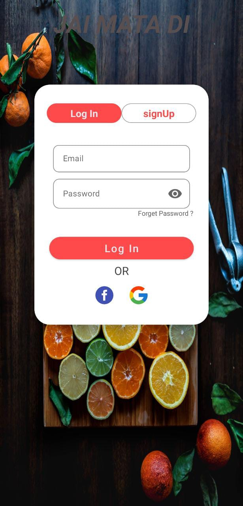
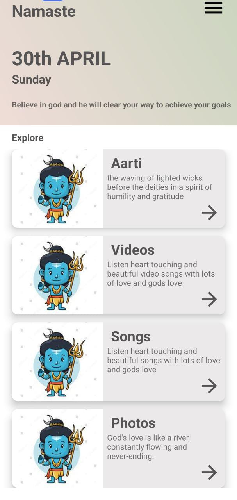
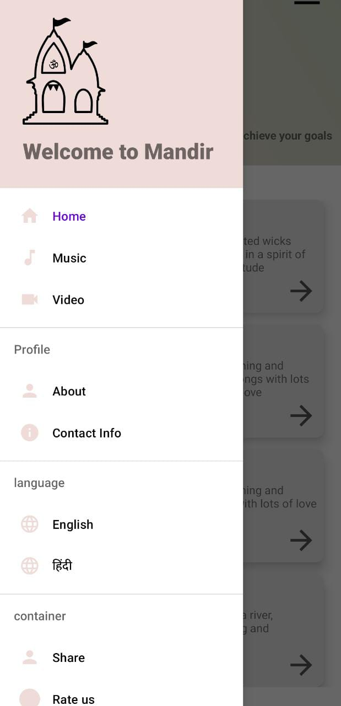
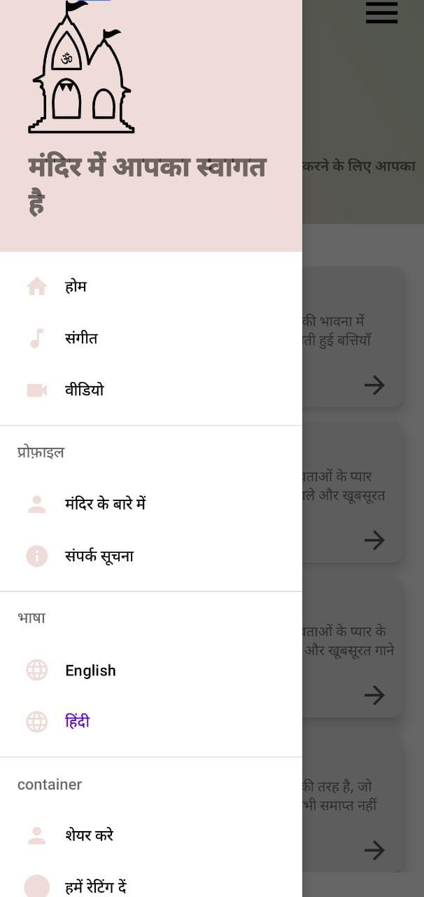
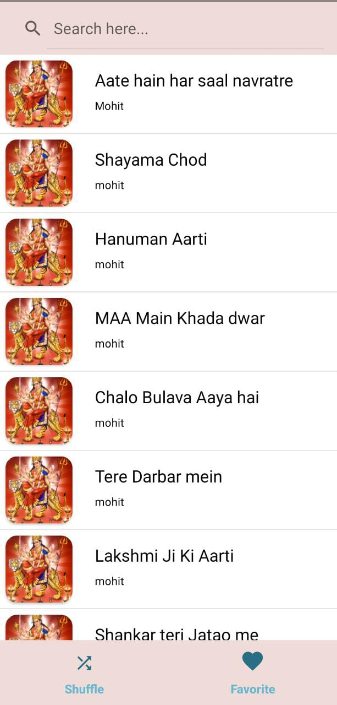
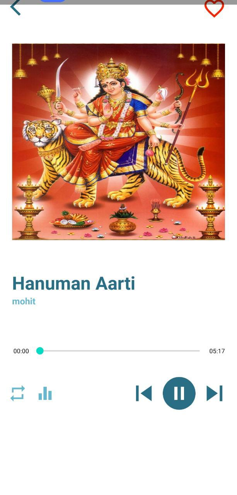

# **Temple App | Android**
---

Welcome to Temple Android app!

### Requirements

- Android OS version 5.0 or newer

### Screenshots

  
  
  

  
   
  

### Benefits
- Get the Videos,Music,photos,aarti in hands
- Easy to use
- Free
- Time Saving

### Want to Contribute?

We appreciate any feedback or comments you have about our Android App. If you feel like going even further and jumping into our code, you are more than welcome to do so.

To get the code running just follow the following steps:

- [Get the code with cloning our GitHub repository](https://help.github.com/articles/cloning-a-repository)
- [Set up your Android Development Environment](https://developer.android.com/topic/instant-apps/getting-started/setup.html)
- [Import Notes Sharing Android Open Source Project to your IDE](https://developer.android.com/studio/projects/create-project.html#ImportAProject)
- [Run the code with Gradle Task: install_debug](https://developer.android.com/studio/run/index.html#gradle-console)
